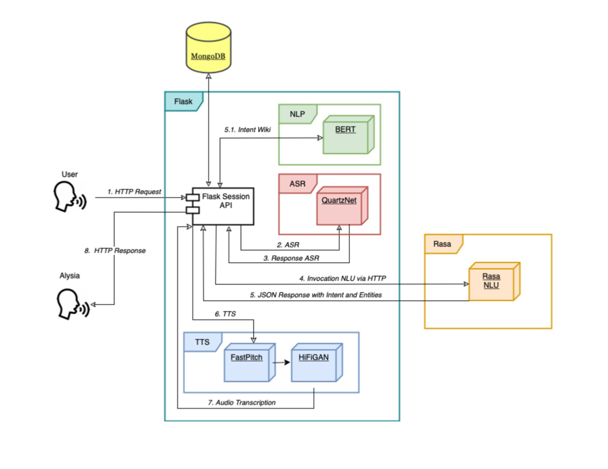

# NeMo Virtual Assistant

  
  
  
  
  
  

NVIDIA NeMo is a conversational AI toolkit built for researchers working on automatic speech recognition (ASR), natural language processing (NLP), and text-to-speech synthesis (TTS). The primary objective of NeMo is to help researchers from industry and academia to reuse prior work (code and pretrained models and make it easier to create new conversational AI models.
The project is based on this framework and, within the use of Rasa NLU processes, we can build and integrate components for a conversional AI. The aim of the project is to build an artificial intelligence agent to support people in specific task domains, generally the dataset of the NLU can merge, integrate and transform the supported tasks. Furthermore, we can have a chat for the trascriptions of the speeches between the agent and the customers to save a speech status in the session.

  

## Rasa 
Project integrates NeMo framework with the Rasa NLU. Rasa helps you build contextual assistants capable of having layered conversations with lots of back-and-forth. In order for a human to have a meaningful exchange with a contextual assistant, the assistant needs to be able to use context to build on things that were previously discussed – Rasa enables you to build assistants that can do this in a scalable way.

## Components
The project is composed by two elements which has some setups before to start the project.
<ul>
<li>Flask Server - for the ASR and TTS invocations</li>
<li>Rasa Shell Container - for the environment on the Rasa Server</li>
</ul>

## Requirements

<ul>
<li>Python 3.6, 3.7 or 3.8</li>
<li>Pytorch 1.10.0 or above</li>
</ul>

For the rest of dependencies in Python, run `pip install -r requirements.txt` in a virtual environment

## Step-to-Step Guide

Some parts of the environment provides some containers in docker. Please, you must follow the Docker setup section. Project runs on docker, so you need to download it via apt:
- `sudo apt install docker`
- `sudo apt install docker-compose`

For problems about Docker setting, check the getting started guide on: https://docs.docker.com/get-started/

## Environment setup

For an easy setup of the dependencies, build and run the image and servers from the Dockerfile or the respective directories following these steps. You must have 2 terminals to run correctly each component.  

In the first one, you have to run the django server:  
- <b>Step 1</b>: `python3 -m venv venv` or `python -m venv venv`
- <b>Step 2</b>: `source venv/bin/activate` (Linux/MacOS) or `.\venv\bin\activate` (Windows)
- <b>Step 3</b>: `pip3 install -i requirements.txt`
- <b>Step 4</b>: `cd nemo && python3 server.py` 

**IMPORTANT:** You must be in the nemo/ directory during the launch of the server to provides good references on the directory system)

For the second one, you have to run the Rasa shell:
- <b>Step 1</b>: Go into the rasa project folder with the Dockerfile and type `sudo docker image build -f Dockerfile_shell.dockerfile -t rasa-shell .`
- <b>Step 2</b>: Going in the main directory the third terminal and type `cd rasa && sudo docker run -it -p 5005:5005 --network jarvis-net --mount "type=bind,source=$(pwd)/,target=/app" rasa-shell`
 
Finally, you can go to `localhost:4000` and play with the Jarvis IA

## Contributors
- Andrea Gurioli (@andreagurioli1995)
- Giovanni Pietrucci (@giovanniPi997)
- Mario Sessa (@kode-git)
